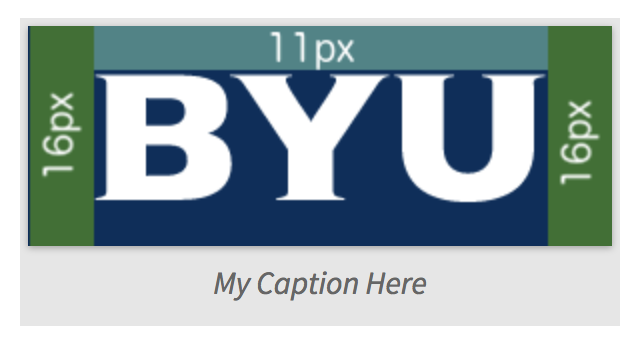

# style-guide

This repository is the source for the BYU Web style guide. The site is build using [Jekyll](https://jekyllrb.com/) and is hosted on Github Pages.

# Editing the specifications

All content is written in [Github-flavored Markdown](https://guides.github.com/features/mastering-markdown/), and is organized into one of
six categories:

* Style - Generic style guidelines, such as color palettes and font stacks.
* Theme - The byu-wide header, navigation bar, and footer.
* Layout - Guides and suggestions on how to lay out content on a page. 'Templates' in atomic design.
* Organization - Site-level organization. How to build effective navigation, split content across effective pages, etc.
* Components - Designs for small, re-useable components, like buttons, cards, inputs, etc. 'Atoms' in atomic design.
* Patterns - Larger design patterns, such as news feeds, calendars, form layouts, etc. 'Molecules' and 'Organisms' in atomic design.

All specifications and related files live in the `specs` folder. Each category has a folder within `specs`.

**Unless you know what you are doing, do not edit anything outside of `specs`**. Here there be dragons!

Each category should have an `index.md` file that serves as a landing page for that category.

All specification files must start with a header like the following in order for Jekyll to include them in the site:

```
---
title: Header
order: 1
---
```

The `title` field is the text which will be shown on navigation links to this page. The `order` field determines the order in which the title will show on the navigation bar.

If you're unfamiliar with Markdown, it is suggested that you edit the files directly on Github, which includes a basic WYSIWYG editor.

## Helpful Tools

In addition to the formatting available in Markdown, our site includes some tools
to help produce high-quality specifications.

The source for these tools are in `_includes` and the styles are in `_sass/blocks`.

### Image with Caption

This renders a consistent, nicely-formatted image with a caption. Almost all
images in a specification should use this layout.

```

```

will render something like:




### Desktop and Mobile Comparison

Often, we will have images of the same content on Desktop and on Mobile. These can easily be displayed in a tabbed view with:

```

```

### Coming Soon

Blocks that are coming soon:

* Color Palette links (so you can just say 'navy' and have a link to the definition of 'navy').
* Font Stack links (so you can just say 'the Vitesse stack' and have a link to the stack, fallbacks, and example images).

## Specification Content

Good specifications include a mix of graphics and text to both explain and show the specifications.

The specification should be complete enough that two different people with no foreknowledge of
the design should be able to independently create visually-identical implementations
of the specification without having to ask the original designer for clarifications.
They should also be flexible enough that they can be adapted to a wide variety of use cases
and design considerations.

The specification should explain:

1. Underlying Design principles
2. The Why, The What, and The How
3. Fonts
    * Font styles. This means font family, weight, size, font style, font stack (including fall backs)
    * Font styles should be concise. We encourage only a few per font styles and we highly encourage using the same font styles.
4. Breakpoints
    * And differences at those breakpoints
5. Colors
    * Different shades of each, when and where to each, and what colors of text are allowed with each.
    * Sizing & Measurements
    * Present measurements with consideration to the CSS box model.
    * When appropriate, the measurement should or can be a percentage. Please be aware of trying to make designs fluid.
    * Please be comfortable with using and understanding flexbox.
6. Padding & Margin
    * Please understand the difference between padding and margin.
    * Please understand the CSS box model. We need this to be considered when specifying padding and margin.
7. Image Formats (if applicable to the design)
    * Specs should include sizes, and image ratios. 
    * Consider how the image handles at different breakpoints. 
    * What image types are appropriate
    * Please use svg files whenever possible.  This means anything but a photo should be SVG. SVG is Scalable vector graphic. It performs well at small and large and is a smaller file.
    * Photos should be jpg or png.
8. Use Cases & Corner cases
    * The specs should specify how the design handles common and unique cases.


# Site Wiring

Whenever the `master` branch is pushed to Github, Github pages will run Jekyll on our site source and produce HTML that will be served by Github Pages.

Jekyll requires a specific [site layout](https://jekyllrb.com/docs/structure/):

* `_config.yml` - contains Jekyll's configuration settings, including the top-level navigation.
* `Gemfile` - Used to run Jekyll locally.
* `index.md` - Placeholder for the site homepage. Content is actually in `_layouts/home.html`.
* `_includes/` - Blocks that are available to be included in other pages. See [the docs](https://jekyllrb.com/docs/includes/) for more.
* `_layouts/` - Base layouts for the rendered pages
    * `default.html` - Basic layout
    * `home.html` - the actual HTML for the site's homepage
    * `spec-home.html` - Layout for the home page of a specification category
    * `spec.html` - Layout for a specification page.
* `_sass/` - SASS files. These are included for inclusion in the top-level SCSS files (in `assets`), and are not directly rendered to CSS.
    * `theme/` - SCSS related to the main page layout and theme.
        * `_colors.scss` - Common colors
        * `_layout.scss` - top-level layout
        * `_mixins.scss` - common mixins
        * `_type.scss` - Typography
    * `blocks/` - styles for the helper blocks (see above).
    *  `site.scss` - pulls together everything that goes in the site-wide CSS
* `_site/` - where the rendered site files go when running Jekyll locally
* `_specs_*/` - Links to the directories under `specs/`. Makes Jekyll work while maintaining in a nice organization of our code.
* `assets/` - site-wide assets. Text assets here, including SCSS files, must start with [YAML Front Matter](https://jekyllrb.com/docs/frontmatter/).
* `readme-images/` - images that are used in the `README.md` file, which is not included in the site.

# Running Jekyll Locally

## Setup

You must have [Ruby](https://www.ruby-lang.org/en/) and [Bundler](http://bundler.io/) installed.

### macOS

Ruby is already installed.

```
gem install bundler
```

## Running

```
bundle exec jekyll serve --incremental
```

If you don't want to remember that, and are on Linux or macOS, just run `run.sh`.

This starts Jekyll, builds your site, and will incrementally re-build it when files change.

Ignore any errors that look like: `** ERROR: directory is already being watched! **`. These are due to the symlinks we use to make our file structure easier to understand for those who aren't familiar with Jekyll.

You can then view your site at `http://localhost:4000/byu-style-guide`.

The site includes `livereload`, so the page should reload whenever there is a file change.
