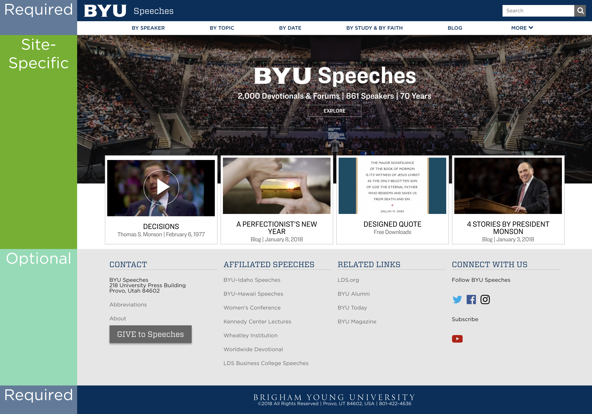

# BYU Web Theme
BYU’s web theme provides a consistent user experience across campus, while also offering flexibility for varying communications needs. To meet these two objectives—consistency and flexibility—the theme includes a header and a footer but leaves the main content area available for customization. The header and footer are mobile responsive and can be used in any content management system or programming environment.

The focus on a consistent header and footer provides a familiar start and finish for all university web pages; it also offers a uniform navigation scheme that users can become accustomed to across BYU’s web space. All BYU web sites should use the theme.

## Required Elements

All BYU sites should use the same [header](header.html), [navigation bar](navigation.html), and [university footer](university-footer.html), with some site-level customizations in each.
Sites may optionally add a [site-specific footer](site-footer.html) above the university footer, but this footer should match the theme specification. 

Everything besides the header and footer may be designed according to a site's unique needs, though designers and developers are encouraged to use the 
[Components]({{'/specs_components/' | relative_url}}) and [Patterns]({{'/specs_patterns/' | relative_url}}) that have been developed by the Web Community.

## Implementation

While these specifications aim to be complete enough to allow you to implement the theme yourself, the Web Community maintains implementations of the theme
for various environments and CMSes, including Drupal and Wordpress.  You can find more information at [the Web Community site](http://webcommunity.byu.edu/byu-theme), 
and you can find help implementing the theme in the [Web Community Slack Team](https://byu-web.slack.com/messages/byu-theme-help/).